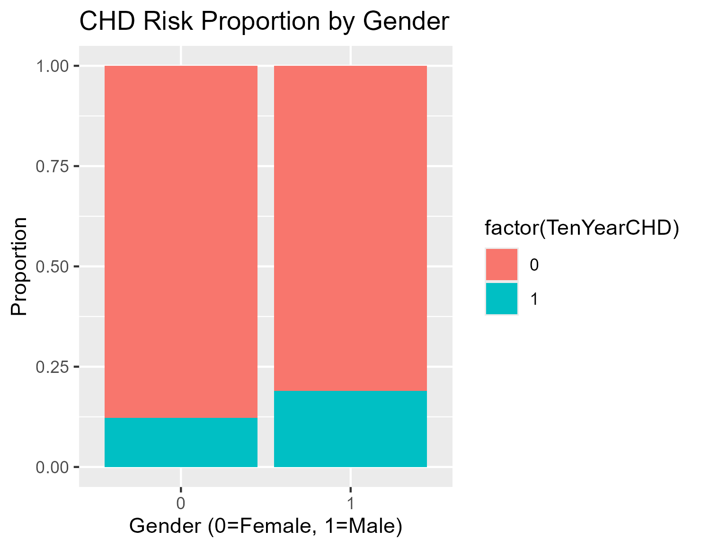
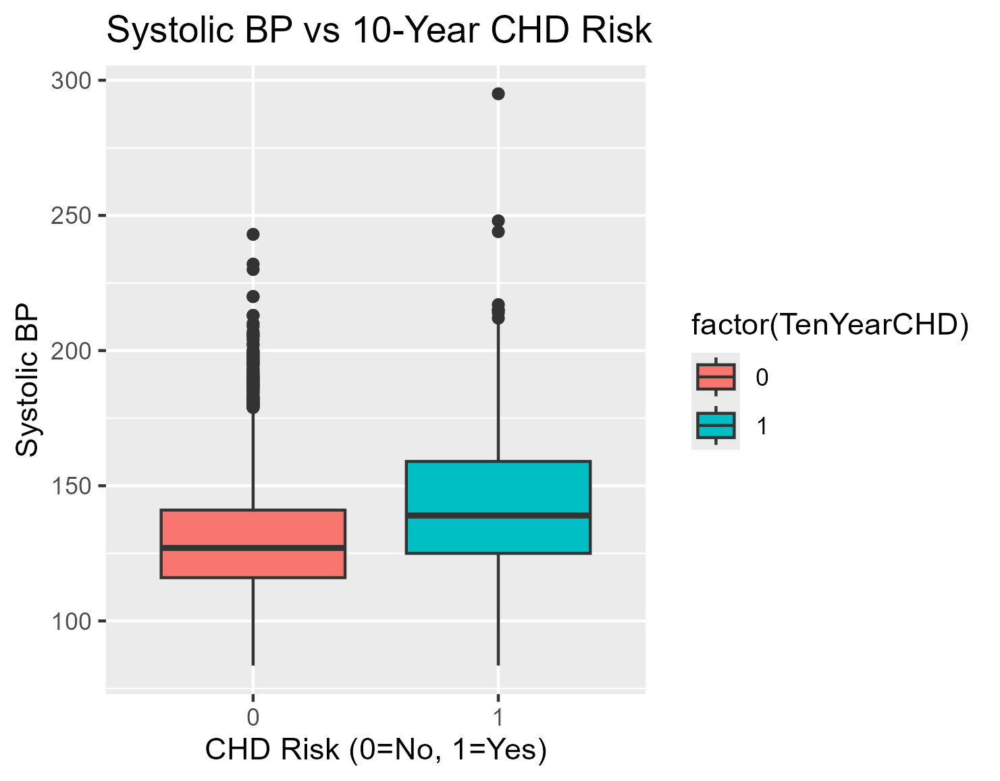

## Step 1: Ask 

Business Task:

Identify the key demographic, behavioral, and medical risk factors associated with a 10-year risk of developing Coronary Heart Disease (CHD) to help health professionals prioritize patient interventions.

## Step 2: Prepare
Load the dataset and inspect its structure to understand the variables (e.g., age, sysBP, glucose, TenYearCHD).

```{Load librabries}
library(tidyverse)
```
```{Load the dataset}
heart_data <- read.csv("framingham.csv")
```
```{View structure and summary}
str(heart_data)
summary(heart_data)
```
## Step 3: Process
The dataset contains missing value, particularly in the **glucose** and **education** columns. Since R cannot perform calculations on missing values (NA), we will remove rows with missing values to ensure accuracy.

```{remove rows with missing values}
heart_data_clean <- na.omit(heart_data)
```

```{confirm cleaning}
sum(is.na(heart_data_clean))
```

Now we have 3656 rows down from 4238.

## Step 4: Analyse
We compare the average health metrics for patients who developed CHD versus those who did not.

```{summary of metrics by CHD risk}
heart_data_clean %>%
  group_by(TenYearCHD) %>%
  summarise(avg_age = mean(age),
            avg_sysBP = mean(sysBP),
            avg_glucose = mean(glucose),
            avg_chol = mean(totChol))
```

Results:


Key findings:

1. **Age**:The average age of those with CHD risk is higher (54.3 years) than those without (48.7 years).
2. **Blood Pressure**:Patients with a 10-year CHD risk have significantly higher average Systolic Blood Pressure (144 mmHg) compared to those without (130 mmHg).
3. **Glucose - Cholesterol**: Higher glucose levels are correlated with increased cholesterol risk.

## Step 5: Share - Visualizing Data
```{Plot 1: CHD Risk by Gender}
ggplot(heart_data_clean, aes(x = factor(male), fill = factor(TenYearCHD))) +
  geom_bar(position = "fill") +
  labs(title = "CHD Risk Proportion by Gender", x = "Gender (0=Female, 1=Male)", y = "Proportion")
```



```{Plot 2: Boxplot of Systolic BP vs CHD Risk}
ggplot(heart_data_clean, aes(x = factor(TenYearCHD), y = sysBP, fill = factor(TenYearCHD))) +
  geom_boxplot() +
  labs(title = "Systolic BP vs 10-Year CHD Risk", x = "CHD Risk (0=No, 1=Yes)", y = "Systolic BP")
```



Visualizations highlight the most significant trends in the data.

1. **CHD Prevalence by Gender**: Males are at a significantly higher risk in this dataset.

2. **Age Distribution**: Risk increases sharply as patients move into their 50s and 60s.

3. **Blood Pressure Impact**: The boxplot shows that higher Systolic BP is a strong indicator of CHD risk.

## Step 6: Act - Recommendations

Based on the analysis, the following health recommendations are formulated:

1. **Prioritize Hypertension Management**: Since Systolic Blood Pressure is one of the strongest differentiators, patients with BP over 140 mmHg should be prioritized for cardiovascular screenings and lifestyle interventions.

2. **Age-Specific Screening**: Increase screening frequency for patients over the age of 50, as the data shows a sharp increase in CHD cases in this demographic.

3. **Targeted Gender Programs**: Given the higher prevalence in men, specific health awareness campaigns should target the male population for early detection.

4. **Glucose Monitoring**: Elevated glucose levels are a notable risk factor; integrated diabetes and heart health management programs are recommended.