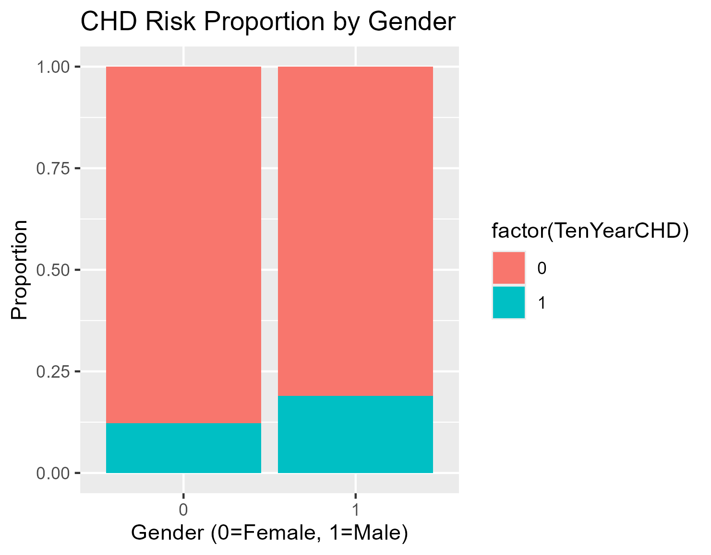
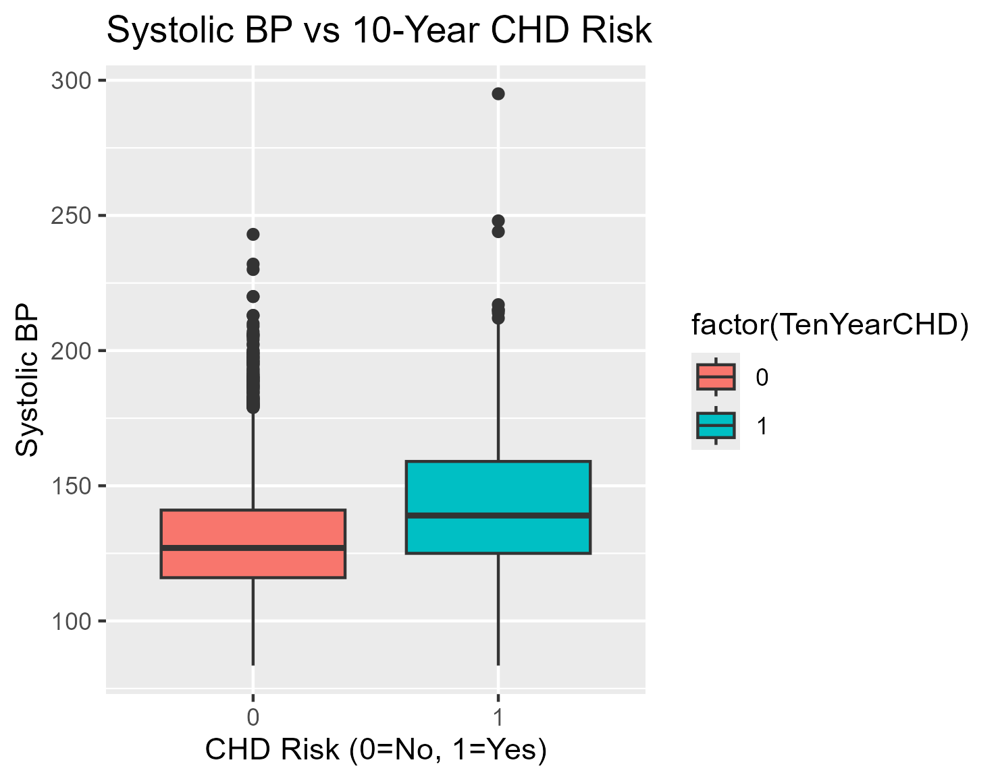

# Heart Disease Study: 10-Year CHD Risk Analysis
## 📌 Project Overview
This project analyzes the Framingham Heart Study dataset to identify critical demographic, behavioral, and medical risk factors associated with a 10-year risk of Coronary Heart Disease (CHD). Using R programming, the study explores how variables like age, gender, and high blood pressure predict cardiovascular health outcomes to help guide early clinical interventions.

## 📊 The Data
The dataset contains information from over 4,000 patients and includes 16 variables such as:

* Demographics: Age, Education, Gender.

* Behavioural: Smoking status, Cigarettes per day.

* Medical History: Blood pressure medication, prevalent stroke, prevalent hypertension, diabetes.

* Current Medical Stats: Total cholesterol, Systolic/Diastolic BP, BMI, Heart rate, Glucose levels.

* Target: TenYearCHD (1 = high risk, 0 = low risk).

## 🚀 Data Analysis Process
**1. Ask**

**Business Task**: Identify which health factors are the strongest predictors of CHD to help healthcare providers prioritise high-risk patients.

**2. Prepare**

Data was sourced from the Framingham study and loaded into R. Initial inspection was performed using `str()` and `summary()` to identify data types and missing values.

**3. Process**

* Cleaning: Handled missing values (NAs) in columns like `glucose` and `education` using `na.omit()`.

* Formatting: Ensured categorical variables were recognised correctly for analysis.

**4. Analyse**

Key statistics were aggregated to compare "At-Risk" vs "Not-at-Risk" groups.

* Blood Pressure: A significant correlation was found between Systolic BP and CHD risk.

* Demographics: Males and older age groups (50+) showed a higher prevalence of risk.

**5. Share**

Data visualisations were created using ggplot2 to illustrate:

* CHD prevalence across genders.
  
  

* The relationship between Systolic Blood Pressure and heart health.

  

* Age distribution of at-risk patients.

**6. Act**

* Recommendation 1: Prioritise patients with Systolic BP > 140 mmHg for cardiovascular screening.

* Recommendation 2: Develop targeted health awareness programs for men, who show a ~19% risk rate compared to ~12% in women.

* Recommendation 3: Integrate glucose monitoring into standard heart health checkups.

## 🛠️ Technologies Used
* Language: R Programming 

* Libraries: `tidyverse`, `ggplot2`, `dplyr`

* Tool: RStudio 

## 🧑‍💻 Connect me - Giang Nguyen

[GitHub](https://github.com/Behindpea/) | [LinkedIn](https://www.linkedin.com/in/giangnh217/)
